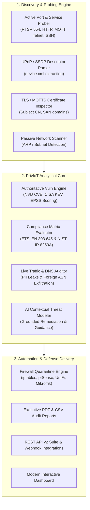

# PrivIoT Shield (Enterprise Edition)
### Autonomous IoT Cybersecurity, Privacy Auditing, & Regulatory Compliance Intelligence Platform

[]()
[]()
[]()
[](LICENSE)

---

## 📌 Executive Overview

**PrivIoT Shield** is an enterprise-grade IoT security and privacy intelligence platform designed to bridge the gap between traditional IT vulnerability scanners and specialized IoT/OT asset governance. 

While conventional vulnerability scanners treat IoT hardware as standard endpoints—frequently failing on proprietary protocols or causing embedded device crashes—**PrivIoT** delivers:
1. **Multi-Protocol Deep Discovery & Fingerprinting** (mDNS/Bonjour, SSDP UPnP XML descriptors, TLS inspection, and non-intrusive banner grabbing).
2. **Authoritative Vulnerability Intelligence** with live **NVD CVE** mappings, **CISA Known Exploited Vulnerabilities (KEV)** detection, and **FIRST.org EPSS (Exploit Prediction Scoring System)** likelihood percentiles.
3. **Formal Regulatory & Privacy Sensitivity Auditing** mapped clause-by-clause against **ETSI EN 303 645**, **NIST IR 8259A/B**, and the **OWASP IoT Top 10**.
4. **Live Traffic & DNS Exfiltration Auditor** that inspects packet streams to catch cleartext credentials, serial leaks, and unauthorized foreign cloud telemetry relays.
5. **Automated Defense & Quarantine Generation**, exporting production firewall isolation rules for **Linux `iptables`/`nftables`**, **pfSense/OPNsense**, **Ubiquiti UniFi**, **MikroTik RouterOS**, and **Pi-hole DNS Sinkholes**.

---

## 🏗️ Platform Architecture



---

## 🎯 Updated Enterprise Use Cases

### 1. Smart Office & Corporate IoT Asset Governance
* **Challenge:** Unmonitored IP cameras, smart TVs, video conferencing hubs, and smart thermostats connect to the corporate Wi-Fi, creating silent lateral pivot points for attackers.
* **PrivIoT Solution:** Automatically scans the enterprise subnets, matches hardware against CISA KEV zero-days, audits whether video feeds/RTSP streams are unauthenticated, and enforces VLAN segmentation.

### 2. Healthcare & Connected Medical Facilities (IoMT Baseline)
* **Challenge:** Connected medical sensors and environmental monitors transmit telemetry over unencrypted local channels, posing severe patient privacy risks.
* **PrivIoT Solution:** Evaluates data protection against **ETSI EN 303 645 Clause 5.7** and **NIST IR 8259A Section 4.3**, flagging cleartext PII/sensor transmissions and foreign broker exfiltration.

### 3. Managed Security Service Providers (MSSPs) & Auditing
* **Challenge:** MSSPs need to deliver board-ready compliance reports showing proof of compliance with the **EU Cyber Resilience Act (CRA)**, **California SB-327**, and international IoT baselines.
* **PrivIoT Solution:** Generates executive PDF audit reports with quantitative compliance percentages, CVSS v3.1 vector breakdowns, and actionable remediation steps.

### 4. Smart Home & Consumer Privacy Defense
* **Challenge:** Consumer smart home devices (smart plugs, robot vacuums, baby monitors) secretly exfiltrate audio, location, and network maps to third-party ad brokers.
* **PrivIoT Solution:** Identifies suspicious outbound cloud brokers (e.g. Tuya, EZVIZ, Hik-Connect) and generates ready-to-import Pi-hole / AdGuard Home DNS sinkhole blocklists.

### 5. Automated Network Quarantine & Incident Containment
* **Challenge:** When an IoT vulnerability is actively weaponized in the wild (CISA KEV), manual firewall reconfiguration is too slow.
* **PrivIoT Solution:** Generates tailored, 1-click firewall scripts for **pfSense, UniFi, Linux `iptables`, and MikroTik** that instantly quarantine the infected device to a restricted VLAN without taking down the network.

---

## 🚀 Quick Start Guide

### Prerequisites
* Python 3.9+ (Python 3.10+ recommended)
* Git

### Installation

1. **Clone the repository:**
   ```bash
   git clone https://github.com/Vrajm12/PrivIoT.git
   cd PrivIoT/PrivIotShield
   ```

2. **Set up virtual environment:**
   ```powershell
   python -m venv venv
   .\venv\Scripts\activate
   ```

3. **Install dependencies:**
   ```bash
   pip install -r requirements.txt
   ```

4. **Launch the application:**
   ```bash
   python app.py
   ```

5. **Access the Dashboard:**
   * Open your browser at: `http://localhost:5000`
   * Default Admin Account: `admin` | Password: `PrivIoTAdmin123!`

---

## 🧪 Automated Test Suite

Run the full production test suite covering all core engines:
```powershell
.\venv\Scripts\python -m unittest discover -s tests -p "test_*.py" -v
```

---

## 🔌 REST API v2 Reference

Authenticate all requests by supplying `X-API-Key: <YOUR_API_KEY>` in the HTTP headers.

| Method | Endpoint | Description |
| :--- | :--- | :--- |
| `POST` | `/api/v2/intelligence/lookup` | Query authoritative CVEs, CISA KEV status, and EPSS scores for any device. |
| `POST` | `/api/v2/compliance/audit` | Execute formal ETSI EN 303 645 & NIST IR 8259A compliance evaluation. |
| `POST` | `/api/v2/remediation/firewall-rules` | Generate tailored iptables, nftables, pfSense, UniFi, and MikroTik isolation scripts. |
| `POST` | `/api/v2/discovery/deep-probe` | Actively probe an IP for open IoT services, banners, and UPnP descriptors. |
| `POST` | `/api/v2/traffic/audit-payload` | Inspect raw packet payload for cleartext passwords, tokens, and PII leaks. |
| `POST` | `/api/v2/traffic/audit-dns` | Audit queried DNS hostnames against known suspicious cloud telemetry destinations. |

---

## 📜 Regulatory Standards Supported

* **ETSI EN 303 645 v2.1.1** — Cyber Security for Consumer IoT: Baseline Requirements
* **NIST IR 8259A / NIST IR 8259B** — IoT Device Cybersecurity Capability Core Baseline
* **OWASP IoT Top 10** — 2024/2025 Edition
* **EU Cyber Resilience Act (CRA)** & **California SB-327**

---

## 📄 License
This project is licensed under the MIT License — see the [LICENSE](LICENSE) file for details.
